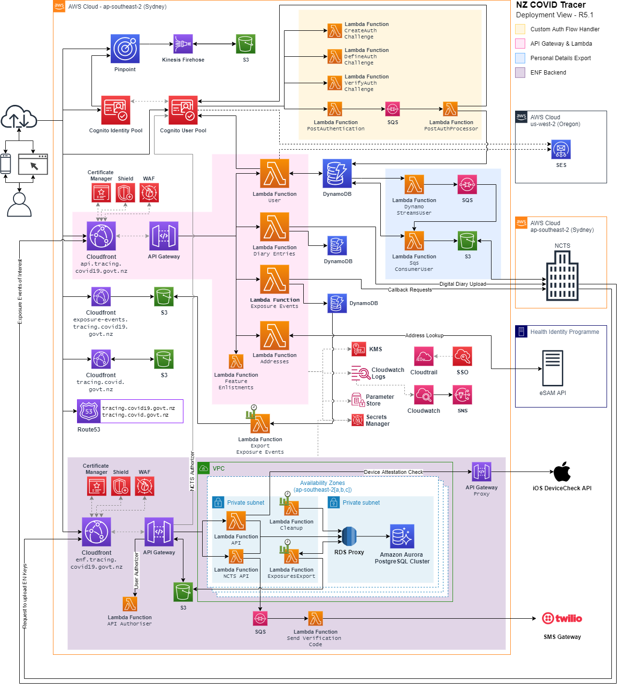

# NZ COVID Tracer - AWS Infrastructure

The solution uses Amazon Web Services in the ap-southeast-2 (Sydney) region for
most of the components. The us-west-2 (Oregon) region is used for the SES 
service as Cognito is not compatible with SES in Sydney. The coloured regions 
in the diagram below show logical groupings of components, but do not 
represent any technical or network segmentation.

Most components run on the AWS Global Network. In Release 3.0.0 a VPC, associated 
networking, and security groups were added to support the backend components 
from COVID Green. This is predominately to allow connectivity to a PostgreSQL 
database, which requires provisioned networking. 

The solution uses the AWS Serverless Application Model (SAM) design pattern for 
the backend components.

API components from COVID Green have been adapted slightly to use Lambda 
functions rather than the reference architecture that used AWS Fargate 
containers.

This diagram shows the deployed components in AWS. Key components are
described in the following table.

| Component                       | Description                                                                                           |
| :------------------------------ | :---------------------------------------------------------------------------------------------------- |
| AWS Cognito User/Identity Pools | Store and manage user accounts, and facilitate the passwordless auth flow                             |
| Custom Auth Flow Handler        | Lambda functions to configure Cognito for passwordless auth flow                                      |
| API Gateway & Lambda            | API endpoints for non-ENF app functions, including contact details, digital diary, and contact alerts |
| Personal Details Export         | A SQS queue and Lambda functions to periodically export contact details to the NCTS Finders Service   |
| ENF Backend                     | A (slightly tweaked) deployment of COVID Green backend components, using Lambda and Amazon Aurora     |
| Pinpoint & Kinesis              | Pinpoint for app analytics, and a Kinesis firehose to export events for use in reporting pipelines.   |
| Exposure Events Cloudfront      | A Cloudfront distribution for published exposure events of interest                                   |
| Personal Details DynamoDB       | Primary persistent storage for user data (excluding ENF) |
