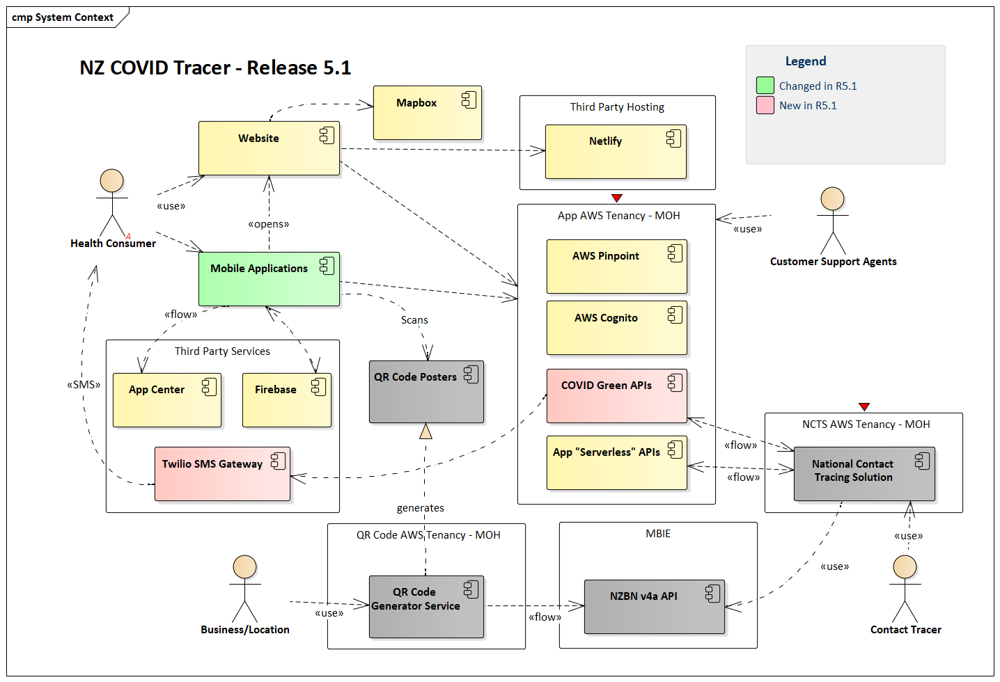

# NZ COVID Tracer - System Overview

In the context of the New Zealand COVID-19 pandemic response the primary objective 
of the solution is to support contact tracing, by providing tools for consumers to
complete the following objectives:

 - Provide up-to-date contact details, so contact tracers can get in contact faster 
   when tracing close contacts of people who have tested positive to COVID-19.
 - Keep a ‘digital diary’ of where they have been and who they have seen, so if they 
   test positive for COVID-19 they can accurately recall their movements to contact 
   tracers.
 - Receive an alert if they have been in the same place around the same time as 
   someone who later tests positive for COVID-19.
 - Record their NHI to speed up identification and processing when presenting for a 
   test a community-based assessment centre. 
 - Allow a user to enable Bluetooth-based Exposure Notifications on their compatible
   iOS or Android smartphone

It is noted that this solution is just one of several technologies and tools that 
contribute to contact tracing in New Zealand, and it is not intended to be a ‘silver bullet’. 

The diagram below shows the high level components used to create the solution. Components
coloured in grey are considered external services.

| Component                         | Description                                                        |
| :-------------------------------- | :----------------------------------------------------------------- |
| Mobile Applications               | The app for iOS and Android, built in React Native                 |
| Website                           | The progressive web app hosted at tracing.covid19.govt.nz          |
| App Serverless APIs               | Backend APIs for the app and website, built using .NET and AWS SAM |
| COVID Green APIs                  | Backend APIs supporting the Apple/Google EN, based off COVID Green |
| AWS Cognito                       | Manages user accounts and identity                                 |
| AWS Pinpoint                      | Records performance analytics and metrics                          |
| Netlify                           | Static asset CDN, hosts the PWA                                    |
| Mapbox                            | Used to render a map for entering location details in PWA          |
| App Center                        | Logs crash reporting and performance diagnostics                   |
| Firebase                          | Used to deliver push notifications to subscribed devices           |
| Twilio SMS Gateway                | Used to deliver SMS messages when a person tests positive          |
| QR Code Generator                 | Web application at qrform.tracing.covid19.govt.nz                  |
| NZBN v4a API                      | Hosted by api.business.govt.nz, used to create Organisation Parts  |
| National Contact Tracing Solution | A Salesforce instance supporting core contact tracing activities   |
