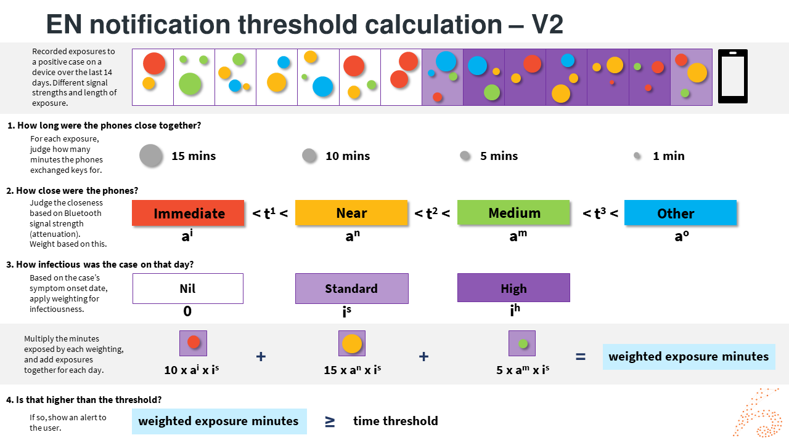

# NZ COVID Tracer - GAEN Notification Algorithm

NZ COVID Tracer uses the COVID Green React Native Exposure Notification Service 
[plugin][1] to interface with the EN framework on the device.

This plugin implements a risk scoring algorithm using the scoring method found 
in iOS v2 and Android v1.6 of the EN framework.

For iOS 13.5 and 13.6 and Android 6 and 7, the old 'V1' version of the scoring is
implemented as a fallback. 

In summary:

- Devices record interactions with other nearby EN-activated devices, including
  attenuation, duration, and other metadata (transmit power, etc). These 
  'exposures' are shown as the coloured dots. 

- When the device downloads Diagnosis Keys (keys from a positive case) it 
  re-calculates the Rolling Proximity Identifiers from those Diagnosis Keys
  and checks if there are any matching identifiers in the record on the device.

- The device calculates the number of "meaningful exposure minutes" using the
  appropriate risk scoring algorithm (either V1 or V2, as described below).
 
- This calculation gives a risk score as "exposure minutes", i.e. the number of 
  cumulative minutes this device has spent in proximity to other devices linked
  to a confirmed positive case of COVID-19.

- If this score is above a given threshold, the user is alerted through a push
  notification and in-app message alerting them to appropriate next steps.

V2 (iOS 12.5 and 13.7+, Android 8+):
- If matching exposures are found they are fed into the risk scoring
  calculation as follows:
    - Sort each exposure into one of four buckets: _immediate_, _near_, 
      _medium_ and _other_, based on the configured `attenuationDurationThresholds`.
    - Multiply the minutes that the exposure took place by
      `immediateDurationWeight`, `nearDurationWeight`, `mediumDurationWeight`,
      or `otherDurationWeight` as appropriate. 
    - Determine whether the exposure took place on a day with `high`, `standard`,
      or no infectiousness based on the configured `infectiousnessForDaysSinceOnsetOfSymptoms`. 
    - Multiply the minutes that the exposure took place by `infectiousnessStandardWeight`,
      `infectiousnessHighWeight`, or 0 as appropriate.
    - Repeat this process for each matching exposure and add together the results.

V1 (iOS 13.5-13.6, Android 6-7):
- If matching exposures are found they are fed into the risk scoring
  calculation as follows:
    - Sort each exposure into one of three buckets, _immediate_, _near_, and 
      _medium_, based on the configured `durationAtAttenuationThresholds`.
    - For each bucket, sum the number of minutes of exposures within that 
      bucket
    - Weight each bucket using the corresponding `thresholdWeightings` value
    - Sum the weighted value to give a total weighted exposure minutes.

- This calculation gives a risk score as "exposure minutes", i.e. the number of 
  cumulative minutes this device has spent in proximity to other devices linked
  to a confirmed positive case of COVID-19.

- If this score is above a given threshold, the user is alerted through a push
  notification and in-app message alerting them to appropriate next steps.

Configuration details are based on Narrow Net V2 from the [Linux Foundation for Public Health narrow-net consensus configuration](https://github.com/lfph/gaen-risk-scoring/blob/main/risk-scoring.md). 
Please see [configuration details as of version 6.1.0](./en-configuration.jsonc)
for the current thresholds and attenuation settings. 

[1]: https://github.com/covidgreen/react-native-exposure-notification-service
[2]: https://developer.apple.com/documentation/exposurenotification/enexposureconfiguration/3583692-minimumriskscore
[3]: https://developer.apple.com/documentation/exposurenotification/enexposureconfiguration/3586319-attenuationlevelvalues
[4]: https://developer.apple.com/documentation/exposurenotification/enexposureconfiguration/3583687-attenuationweight
[5]: https://developer.apple.com/documentation/exposurenotification/enexposureconfiguration/3586320-dayssincelastexposurelevelvalues
[6]: https://developer.apple.com/documentation/exposurenotification/enexposureconfiguration/3583689-dayssincelastexposureweight
[7]: https://developer.apple.com/documentation/exposurenotification/enexposureconfiguration/3586321-durationlevelvalues
[8]: https://developer.apple.com/documentation/exposurenotification/enexposureconfiguration/3583691-durationweight
[9]: https://developer.apple.com/documentation/exposurenotification/enexposureconfiguration/3586323-transmissionrisklevelvalues
[10]: https://developer.apple.com/documentation/exposurenotification/enexposureconfiguration/3583694-transmissionriskweight
