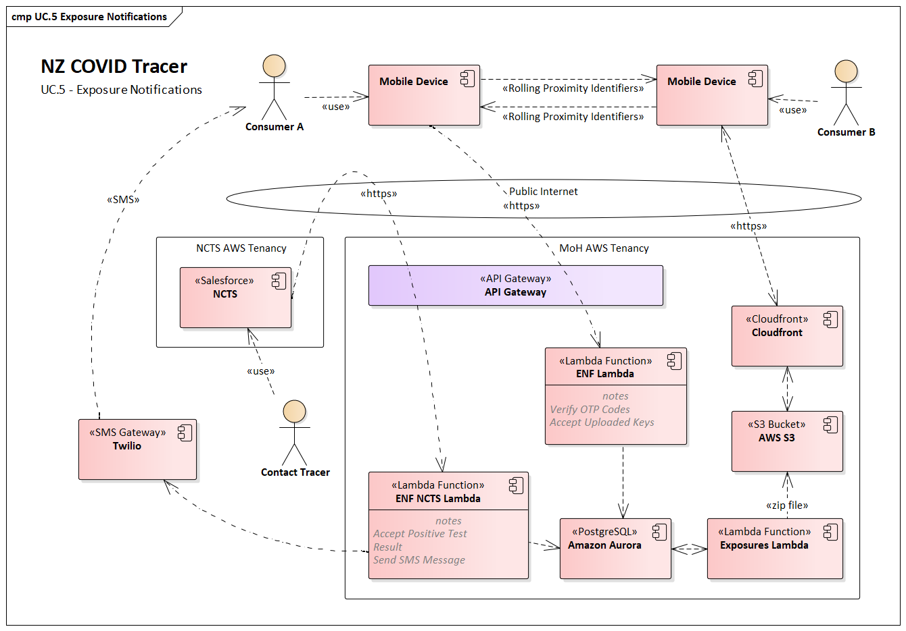
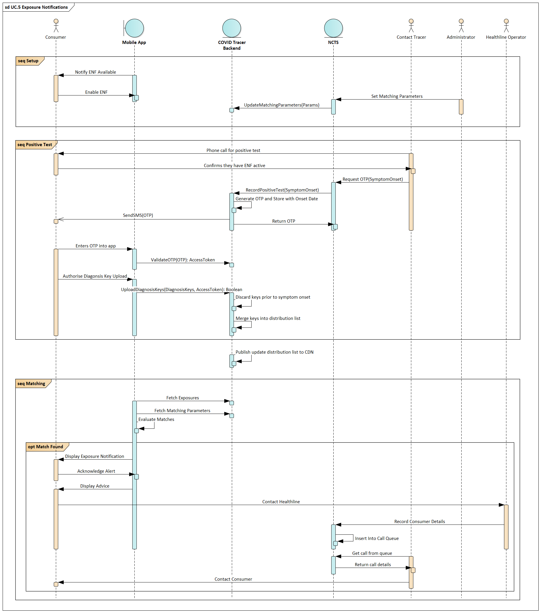

# NZ COVID Tracer - Google/Apple Exposure Notifications (GAEN)

Early in the COVID-19 pandemic Google and Apple collaborated to develop the 
Exposure Notifications (EN) framework, for using Bluetooth in smartphones to 
record interactions with other devices. 

Apple and Google have published documentation, including the 
[Bluetooth specification][1] and [Cryptography specification][2], that detail
how the framework works at a protocol level. There is also set of
[frequently asked questions][3]  detailing the privacy, data, and governance 
aspects. Components for this aspect of the solution are largely re-used 
from the [COVID Green open source project][4].

Once enabled, the device will generate a random key each day (the Temporary 
Exposure Key, TEK). This key is used to derive a new key every 10 minutes (the 
Rolling Proximity Identifier, RPI).

These Rolling Proximity Identifiers are exchanged between devices in proximity 
to each other and recorded on the device along with a signal attenuation, 
duration, and some metadata about transmit power and device configuration to 
help with estimating distance.

This exchange is handled by the operating system, and the app is simply used to
activate it within New Zealand. Information recorded through this exchange is
kept on the device for 14 days and protected by the operating system controls.

During a case interview a person is given the option to share their Bluetooth 
Tracing keys. If they consent, they are sent an SMS with a 6-digit code that 
can be used to authenticate the upload of the last 14 days of Temporary 
Exposure Keys. These uploaded keys are called Diagnosis Keys. After upload any
keys prior to the person’s symptom onset date are discarded, and the remaining 
Diagnosis Keys are merged into a list and published publicly to a CloudFront
distribution.

This list is queried by all active devices approximately every two hours to 
check for potential exposures. This is done by downloading the list of 
Diagnosis Keys and regenerating the Rolling Proximity Identifiers to compare 
with the ones recorded on the device.

If a match is detected it is fed into a risk scoring algorithm (detailed 
below). If the risk score is calculated above a nominated threshold, an alert 
is displayed to the user informing them of their exposure risk.

The SMS to the user is sent via the Twilio SMS Gateway, using a dedicated 
shortcode to improve deliverability rates.

GAEN can only be activated on devices that support it. At a minimum the 
following requirements apply:
 - iOS 13.5 or above
    - The device can pass Apple DeviceCheck attestation
 - Android 6 and above, with the following conditions:
    - The device is using Google Play services, and
    - The device supports and can pass the SafetyNet Attestation
    - The device supports Bluetooth Low Energy 

## Sharing Bluetooth tracing keys

After a positive test the user can consent to sharing the most recent 14 days 
of Temporary Exposure Keys with other users, so they can be alerted if they 
were at risk of contracting COVID-19. 

  1. The user tests positive for COVID-19 and is called by a contact tracer.
  1. At some point during the case investigation, usually at the start, they 
     are asked if they want to share their Bluetooth tracing keys.
  2. If they consent, the contact tracer initiates an OTP request from the NCTS
     to the COVID Tracer backend. This request includes the phone number of the
     user and the date the user became infectious (labelled as symptomOnset).
  3. This data is recorded in the COVID Tracer backend and a numeric 6-digit 
     one-time-password is generated and sent to the user’s mobile number via 
     SMS. This OTP is valid for 24 hours.
  4. The user receives the SMS and enters it into the app. They are presented 
     with a consent screen and must grant permission for the app to read their
     Diagnosis Keys, the name given to Temporary Exposure Keys associated with
     a positive case.
  5. The Diagnosis Keys are then packaged and uploaded to the COVID Tracer 
     backend along with the Access Token. To verify the authenticity of the 
     device a signature using either the Apple Device DeviceCheck API or the 
     Google SafetyNet Attestation API is also included in the upload.
  6. Any keys generated prior to the symptomOnset date are discarded
  7. The remaining Diagnosis Keys are then recorded in a PostgreSQL database 
     for later distribution.
  8. Every 5 minutes a Lambda function copies any new Diagnosis Keys from the 
     PostgreSQL database into a file, which is then saved to S3 and published 
     via Cloudfront.
  9. This file is signed using a private key, and the device uses the 
     corresponding public key shared with Apple & Google to verity the 
     authenticity of the file when it is downloaded.

Each two hours active devices will poll the Cloudfront distribution for any new
Diagnosis Keys to be compared locally with recorded Rolling Proximity 
Identifiers on the device.

  1. The device will check for a new file periodically. This file is a delta,
     so the device will not repeatedly download the most recent file and 
     therefore should only use minimal data to check for new exposures
  2. The device also downloads the latest copy of the configuration used to 
     calculate exposure risk.
  3. Once downloaded, the authenticity of the file is checked using the 
     published public key. Invalid signatures are discarded.
  4. Then for each Diagnosis Key in the file the operating system does the 
     following:

      1. Using the Rolling Period Start Interval, and the Period Length (10 
         minutes), derive each of the Rolling Proximity Identifiers that the 
         device would have seen from that Diagnosis Key
      2. For each of these generated Rolling Proximity Identifiers, search the 
         locally recorded list of Rolling Proximity Identifiers for a match.
      3. Any matching identifiers are included in the risk scoring algorithm. 
         This algorithm is detailed below.
      4. If a sufficient risk score is calculated an alert is shown to the user 
         notifying them of the risk and recommended next actions.
      5. For the initial release, this will be instructions to self-isolate and
         call Healthline for advice.

[1]: https://covid19-static.cdn-apple.com/applications/covid19/current/static/contact-tracing/pdf/ExposureNotification-BluetoothSpecificationv1.2.pdf?1
[2]: https://covid19-static.cdn-apple.com/applications/covid19/current/static/contact-tracing/pdf/ExposureNotification-CryptographySpecificationv1.2.pdf?1
[3]: https://covid19-static.cdn-apple.com/applications/covid19/current/static/contact-tracing/pdf/ExposureNotification-FAQv1.2.pdf
[4]: https://github.com/covidgreen