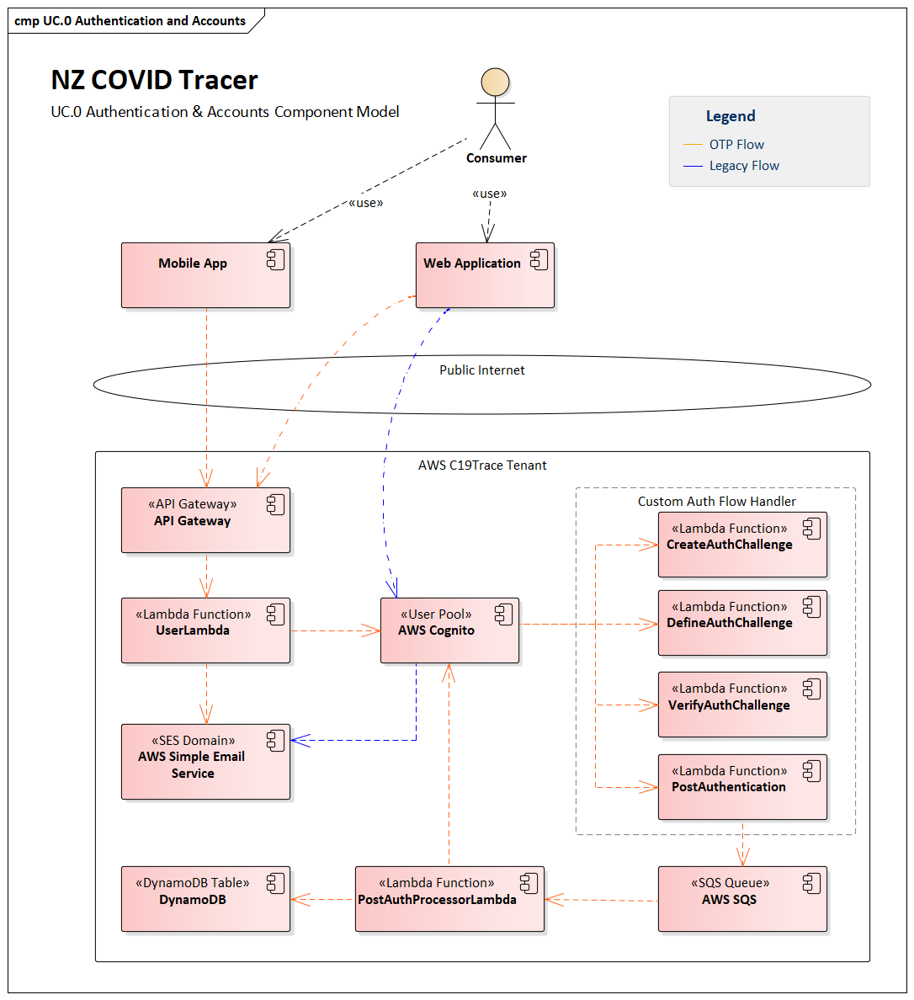
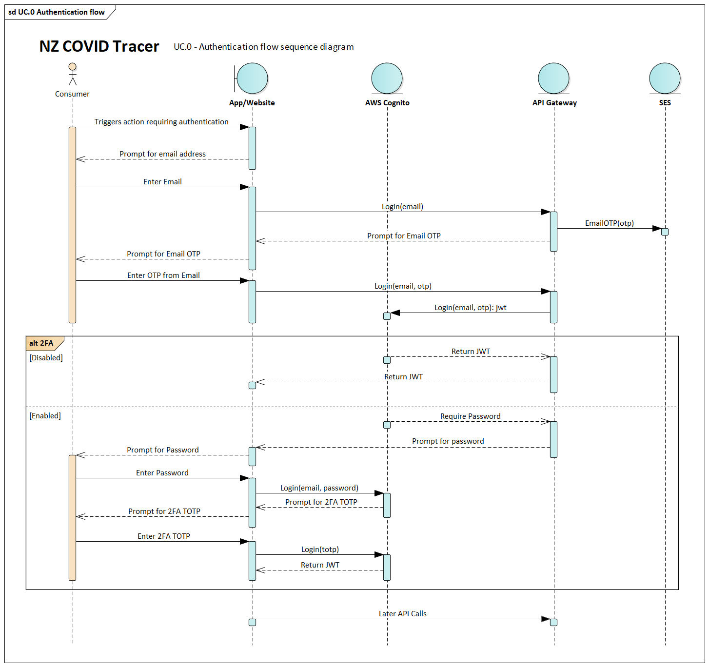

# NZ COVID Tracer - Authentication

The initial release of NZ COVID Tracer required users to create an account with
their email address and a NZISM-compliant password. Users could also choose to
enabled two-factor authentication using a time-based one time password (TOTP)
to further secure their account.

In Release 2.0.0 a new password-less authentication scheme was introduced, and 
users are no longer required to maintain an active session to use the app.  

User identity and authentication is managed by AWS Cognito. Cognito stores a 
unique email address for each user, and generates a UUID as the User ID.

From Release 2.0.0 a ‘password-less’ authentication flow is used to authenticate 
users. People who had registered prior to Release 2.0.0 and had enabled two-factor 
authentication will continue to authenticate with their email, password, 
and TOTP authenticator app. 

Cognito issues a JSON Web Token (JWT) upon successful authentication. This JWT 
is then used as the credential to authorise the user to access other AWS services 
and the API. The lifecycle and verification of this JWT is handled by AWS.

The Custom Auth Flow Handler component is a composite of Lambda functions 
implementing the password-less flow in Cognito. 

This pattern was chosen as many of the functions in the app do not require a 
persistent user session, and the features that do need authentication (such as 
updating contact details) are done infrequently. 

When a user is attempting to access an authenticated endpoint, the following 
sequence occurs:

  1. The user is prompted to enter their email address,
  2. Email address is submitted to the UserLambda, which triggers a short-lived one-time password to be sent to that email address.
  3. The user receives the email and enters the OTP
  4. If the OTP is not valid or they didn’t receive it
      1. the user is requested to try again, or
      2. resend the OTP again
  5. If an account does not exist for that email address
      1. An account is created in Cognito for that email address
  6. Load the user account from the Cognito User Pool.
  7. If the account has 2FA enabled:
      1. The user is prompted to enter their password,
      2. If the password is valid the user is prompted to enter their TOTP code from their authenticator app, then the user is logged in.
  8.  If the account does not have 2FA enabled (the overwhelming majority do not):
      1.  No further input is required from the user
  9. Once the user is authenticated a JWT is returned to for later calls to the API.
