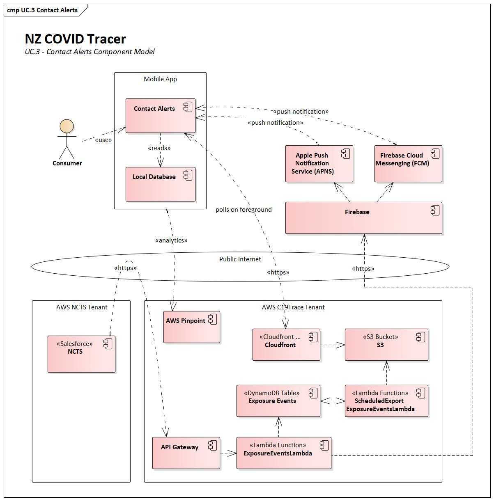
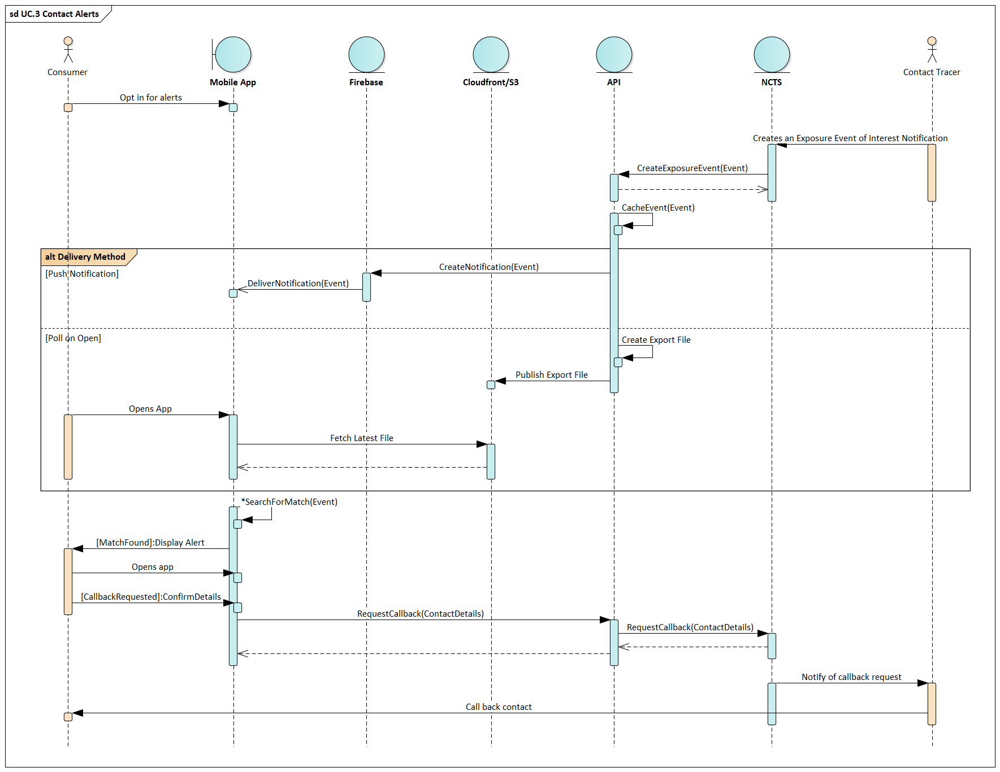

# NZ COVID Tracer - Location Contact Alerts

Contact tracers can notify people of a potential exposure to COVID-19 by 
issuing a contact alert via the app. An alert contains a SHA384 hash of the GLN
of the location of interest, the start time, and the end time of the possible
exposure. The alert is delivered to a device with two methods:

 - via a silent push notification to every device running the app that is 
   subscribed to contact alerts, and
 - by polling a public endpoint containing all active exposure events when 
   the app returns to the foreground.

If a matching GLN within the given time range is found on the device the user 
will see a notification message on their device. This matching process happens 
on the device, to preserve the user's privacy.

A card is shown on the dashboard that notifies the user of the potential 
exposure to COVID-19, and advises them of any recommended next actions. 
Currently the app supports two actions:

 - Notify: The default message tells the user they may have been exposed, 
   and to seek medical advice from Healthline or their GP if they begin to 
   feel unwell. This message is customisable by the contact tracer, and may 
   also suggest other actions such as booking a test.
 - Request a callback: The user is prompted to confirm their contact 
   information (name, phone number, and any special instructions), which is 
   then passed back to the NCTS for a contact tracer to give them a call.

It is at the contact tracer's discretion which message is shown to the user. 
Users can dismiss this message, and once it is dismissed it cannot be 
recovered.

## Issuing Contact Alerts

Contact alerts are triggered by a contact tracer issuing an Exposure Event 
of Interest Notification from the NCTS. The flow for this process is as 
follows:

  1. A contact tracer determines that it is necessary to send an Exposure Event
     of Interest Notification as a consequence of a case investigation. The 
     factors that determine if an alert is sent are based on clinical judgement 
     and the circumstances of the event.
  2. The notification is issued from the NCTS and received by a HTTPs call to 
     the API.
  3. The payload of this request contains 
      1. the GLN of the location of interest, 
      2. the start time and the end time of the potential exposure,
      3. the text to display to the user in the app,
      4. an Exposure Event ID representing this exposure event,
      5. a Notification ID unique for this notification (multiple notifications
         can be sent for the same event), and
      6. the recommended action the user should take (i.e. show a callback 
         prompt)
  4. This information is cached on the app backend in a DynamoDB table to 
     support the polling for new exposure events when the app is foregrounded.
  5. The notification detail is then sent immediately sent onto Firebase to be
     delivered via a silent mobile push notification to all subscribed devices.
  6. Every 2 hours the `ScheduledExportExposureEventsLambda` executes and 
     writes out the active exposure events to a file and places it in an S3 
     bucket. This file is downloaded by the app when it returns to the 
     foreground in case the push notification is not successfully delivered.
  7. When an exposure event is received by the app (either by push or polling)
     a series of checks are performed. If any check fails, the event is 
     discarded silently and the user is not notified:
      1. Check a notification has not previously been shown for this Exposure 
         Event ID
      2. Search the local database for a matching diary 
      3. A match is determined where the entry has the same GLN SHA384 hash, 
         and the check-in time is contained within the start time and end time
         of the notification
  8. If those conditions are true, an alert is shown to the user: 
      1. If the app is currently in the background a local notification is 
         triggered on the device alerting the user to the possible exposure. 
         This notification is displayed by the operating system as configured 
         by the device’s notification settings (usually on the lock screen or 
         in the notification centre)
      2. The user opens the app to view the alert and take any recommended 
         actions.
  9. If requested by the contact tracer through the alert the user can confirm
     their contact details to receive a call back from contact tracers about 
     the event.

