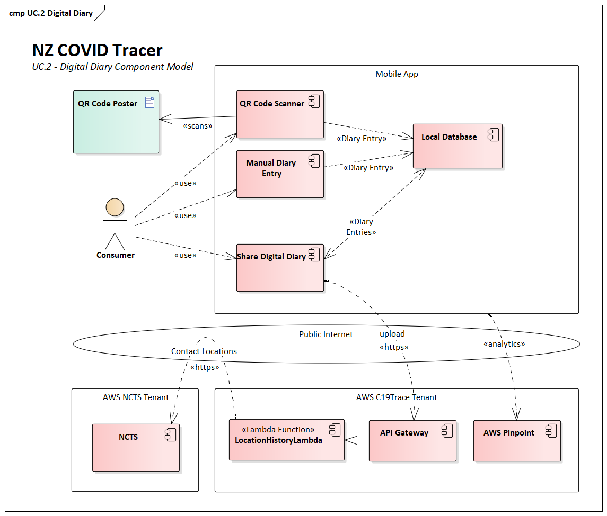
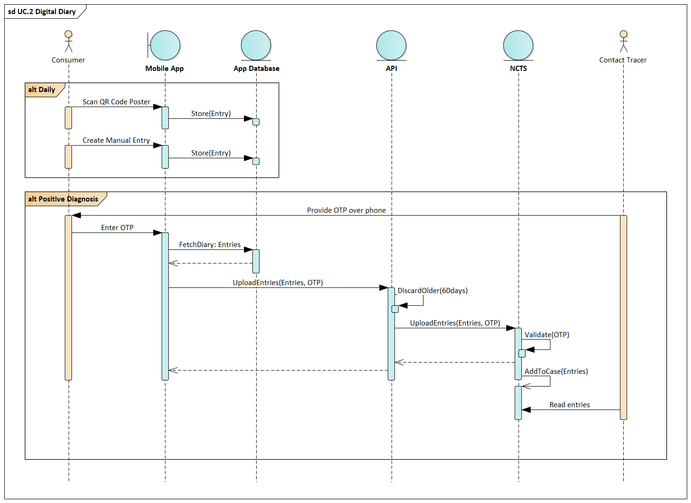

# NZ COVID Tracer - Digital Diary

If a person tests positive for COVID-19 a key part of the case investigation is
understanding where that person went while they were infectious. The difficulty 
is people often find it difficult to remember their precise daily movements 
during this time. The Digital Diary can be used to keep a private record of 
where a user has been on their device. 

The privacy of the digital diary is paramount, and the Ministry has no interest 
in compiling a centralised database of the places a person has been. For this 
reason, the diary is kept locally on the person’s device, and only uploaded if 
the person chooses to if they test positive for COVID-19 and are requested to 
by a contact tracer.

Each time the app returns to the foreground entries that have been created more 
than 60 days ago are automatically deleted, in line with clinical advice on the 
amount of data that is necessary to support a case investigation.

If a user uses multiple phones a separate diary is kept on each device. This 
solution does not implement a function to share a diary between devices. This
means if the app is uninstalled any diary entries on the device will be lost.

Component model diagram

 

## Creating diary entries 

The user uses the app to record entries in their digital diary. An entry can be
created by:

  1. Scanning a QR code
  2. Tapping an NFC tag v6.0
  3. Manually creating a diary entry with details from a previous scanned 
     entry v6.0
  4. Manually creating a diary entry with location name and time of arrival
     written in free text. 

A free-text description can also be added at the time of creation or by editing.

### Adding an entry with a QR code

The primary way of adding a diary entry is through scanning a QR code. 

QR codes and NFC tags contain a GLN, Location Name, and Address as per the
[QR code specification](https://www.health.govt.nz/publication/hiso-100852020-covid-19-contact-tracing-data-standard#qr).
QR code posters can be requested for any New Zealand location for free
using the [Rapid QR Service](https://qrform.tracing.covid19.govt.nz/).

The GLN is obtained through the creation of an Organisation Part within the 
NZBN register, operated by the Companies Office in the Ministry of Business,
Innovation, and Employment. Organisation Parts are based on NZS ISO/IEC 
6523.1.

### Adding an entry with near-field communication (NFC)

Support for adding a diary entry through NFC tags was added in version 6.0.
[The schema is detailed here](../functions/nfc.md).

Like scanning in with a QR code:
- The tag contains the name, address, and GLN of the location.  
- No information about where you have scanned in leaves your device. 

### Adding a manual entry

As of release 6.0.0, a user can manually add a diary entry that has a GLN attached from any
place that they've visited within the diary retention period or that has
been saved. They can also manually add a diary entry that does not have a
GLN attached by writing in a location name and time of visit.

## Viewing, editing, and deleting diary entries

The diary can be accessed from the "My Data" tab or the top right of the "Record a Visit" tab.

 Diary entries with a GLN attached
('scanned entries') can be used to receive [contact alerts](../functions/contact-alerts.md)
and are denoted in the diary with this icon. 

 Diary entries created manually 
with no GLN attached ('written entries') are denoted in the diary with this icon. 

## Saved locations

A user may create a diary entry from a place they have previously scanned in
to by selecting it as the location name when they manually create a diary entry. 

A user may also save the location of a scanned entry so that it is preferentially
displayed when they manually create a diary entry, and they can still manually add
scanned entries with the relevant GLN after the original scan been deleted. 

## Sharing the digital diary

If the user tests positive for COVID-19, they will be called by a contact 
tracer for a case investigation. As part of this call the user can consent to 
share a copy of their digital diary with the contact tracer to assist with the 
case investigation.

If the user consents, the contact tracer gives the user a 6-digit 
one-time-password (OTP) over the phone. This OTP is entered into the app and 
any entries from the last 60 days are uploaded.

Digital diary flow

 

 
  1. The user is given a one-time-password (generated by NCTS) over the phone 
     by the contact tracer. This is what links the diary upload to the correct 
     case in the NCTS. 
  2. The user submits the OTP, and the app collects any relevant diary entries 
     and uploads them to the API.
  3. The API strips any entries that are older than 60 days, and then proxies 
     this request to the NCTS via a REST API.
  4. The NCTS validates that the OTP is valid, if not an error is returned to 
     the user to try again.
  5. The diary entries are attached to the Case record in NCTS as Contact 
     Locations, which are then able to be reviewed by the contact tracer as 
     during their case investigation.
