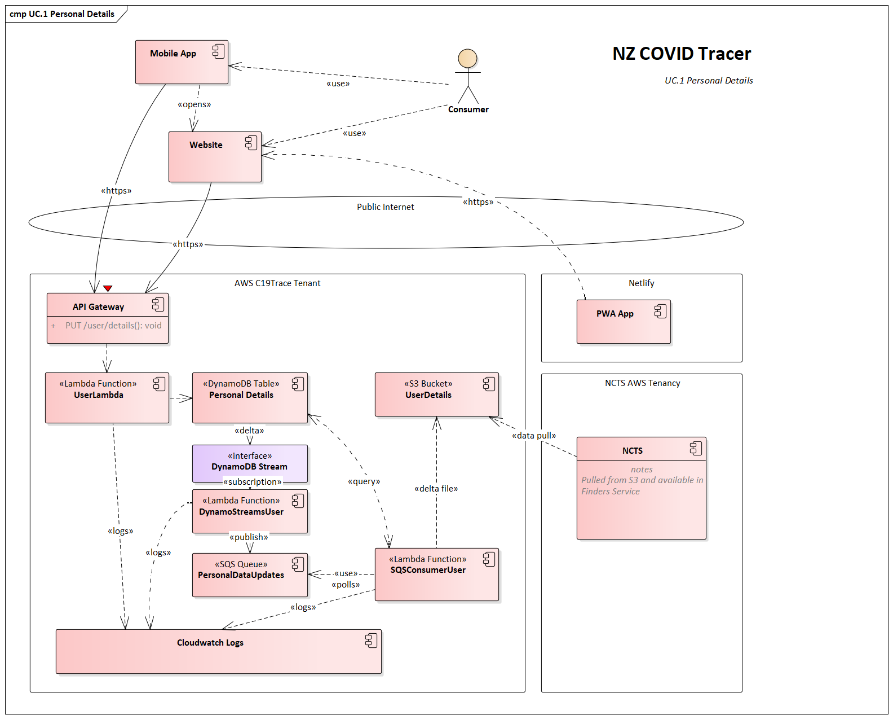

# NZ COVID Tracer - Share Personal Details

A key problem identified at the start of the pandemic was quickly and accurately 
getting in contact with people possibly linked to a confirmed case of COVID-19. 
There are several sources within the health system that can be used for this 
(e.g. the National Health Index and National Enrolement Service), however it was 
difficult to know which sources were current, and no one source was complete.

During app onboarding, or a later time, the user can choose to update their 
contact details so they can be more easily identified and contacted as part of
a case investigation.

In either place the user is required to authenticate before they can store, 
read, or update their contact details.

Contact details collected via the app are held in a DynamoDB table and exported
to the NCTS via a flat file exchange using an S3 bucket. The NCTS AWS account 
has a trust relationship that allows it to read files across AWS accounts. 

  1. User submits their contact details via the app or website
  1. Details are sent to the API and saved to the DynamoDB table so they can 
     be fetched and modified later by the user.
  2. A DynamoDB Stream triggers a Lambda function that batches up to 500 changed 
     User IDs and enqueues them as a single message onto an SQS queue. 
  3. Another Lambda function polls this queue every 5 minutes and fetches any 
     pending tasks from the queue in batches. This Lambda polls SQS in batches 
     of 10, up to 11 times, for a total message count of 110 per trigger. This 
     polling is also capped at 8500 unique UUIDs after which it stops polling 
     further.
  4. For each pending task the User ID is used to do a lookup from DynamoDB for 
     the current state of the full object record. 
  5. This record is written to a file in JSON format, one line per object, one 
     file per trigger execution. Thus, each file can have up to 8,500 
     individual records.
  6. This file is written to S3 with a predicable filename, including the 
     5-minute window this file was generated in.
  7. This file is then later collected by the NCTS system and the contents are 
     able to be queried by the Finders Service during a case investigation.

