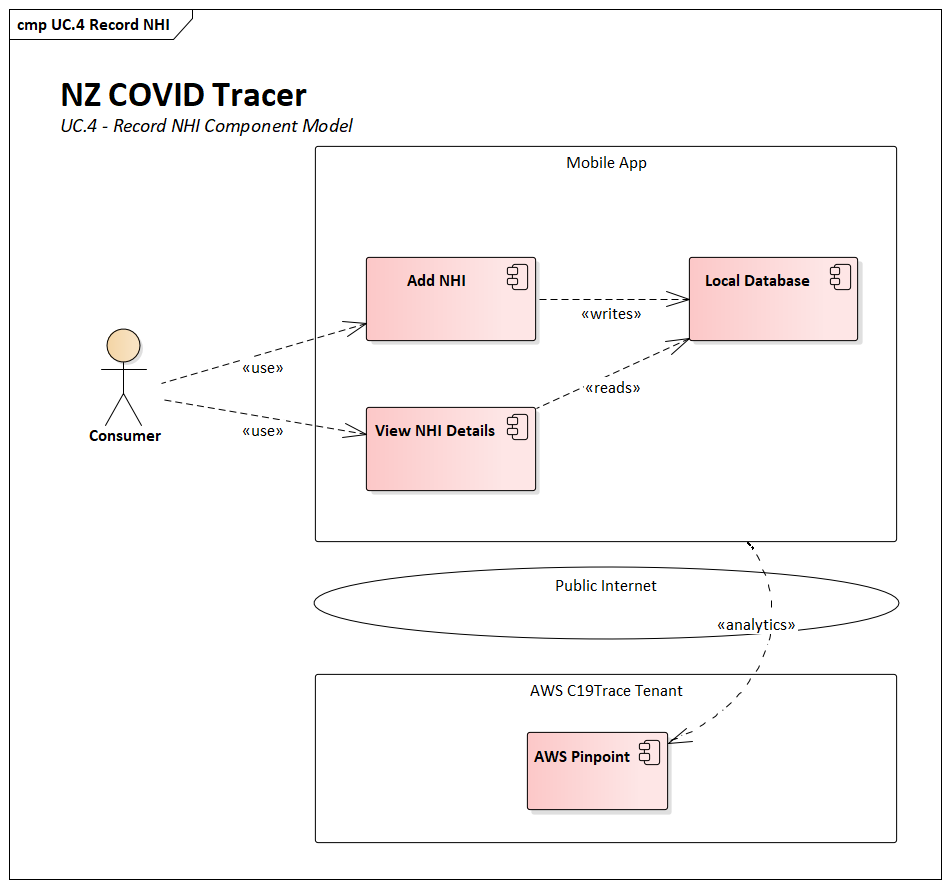
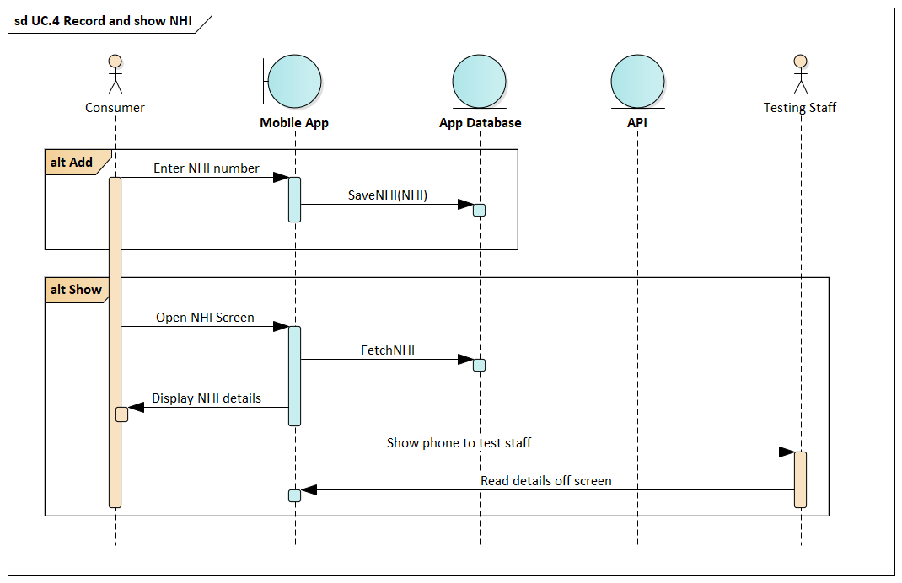

# NZ COVID Tracer - Record NHI

To support faster processing at a testing facility, e.g. a community based 
testing centre, users can proactively add their NHI number to the app so they
have it handy when they get a test.

This number is stored locally on the device and is not currently validated or 
verified. Users are free to add any number as long as it conforms to the NHI 
format. It is still the responsibility of the testing centre staff to verify 
the identity of the person and whether the NHI is correct.

